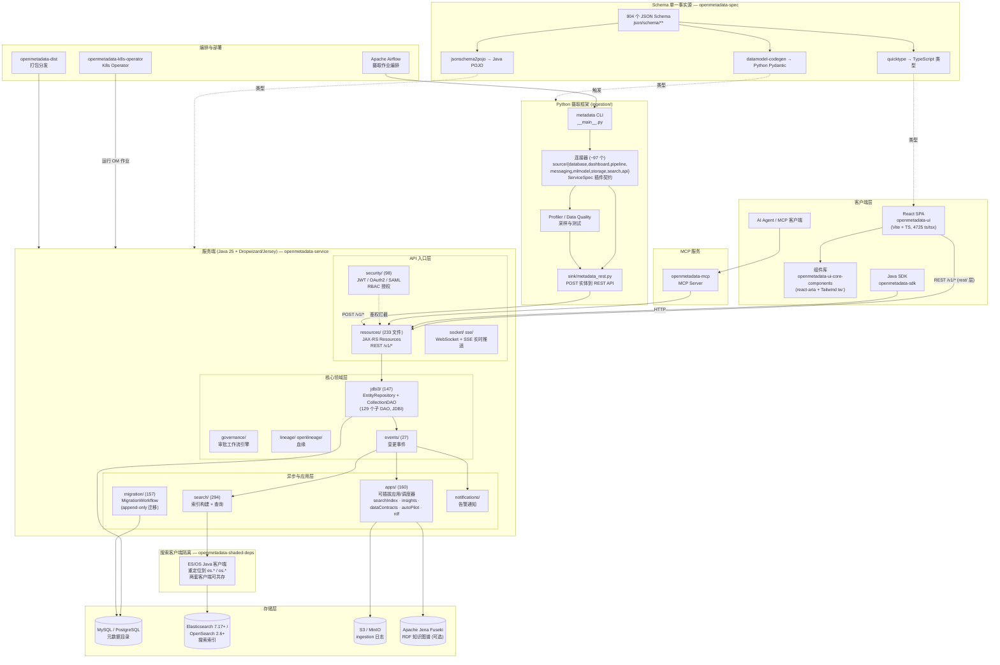
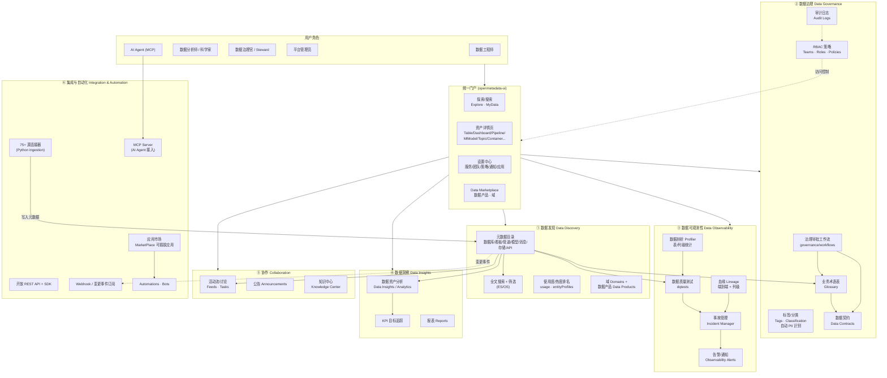

# OpenMetadata 架构图

基于代码库实际结构（`ARCHITECTURE.md`、Maven 模块依赖、`openmetadata-service` 包结构、UI/ingestion 目录）整理，包含**技术架构图**与**业务架构图**两张 Mermaid 图。

---

## 技术架构图

**三条关键请求路径**（详见 `ARCHITECTURE.md`）：

1. **API 请求**（如 `POST /v1/tables`）：`resources/*Resource` → `jdbi3/*Repository` → `CollectionDAO/EntityDAO` → SQL；非 GET 响应同时扇出到 `events/`（变更事件）与 `search/`（索引更新）。
2. **摄取运行**：Airflow / `metadata` CLI 触发 → 连接器经 `service_spec.py` 动态加载（`DefaultSourceLoader`）→ 拓扑 yield 实体 → sink POST 回 REST API（即路径 1）。
3. **搜索查询**：UI `src/rest/` → `SearchResource` → `search/` → 经 shaded `es.*/os.*` 客户端访问 ES/OS。

---

## 业务架构图

**业务能力说明**（与代码的对应关系）：

| 能力域 | 主要代码位置 |
|---|---|
| 数据发现 | `resources/search/`、`resources/domains/`、`resources/usage/`、UI `ExplorePage` / `DataMarketplacePage` |
| 数据治理 | `resources/glossary/`、`resources/tags/`、`resources/policies/`、`resources/datacontract`（+ `apps/bundles/dataContracts`）、`governance/workflows`、`resources/audit` |
| 可观测性 | `resources/dqtests/`、`ingestion` profiler、`resources/events/`（告警）、`resources/lineage/`、UI `IncidentManager` |
| 数据洞察 | `dataInsight/`、`resources/kpi/`、`resources/reports/`、UI `DataInsightPage` |
| 协作 | `resources/feeds/`、`resources/tasks/`、`resources/knowledge/` |
| 集成自动化 | `ingestion/` 连接器、`openmetadata-mcp`、`resources/automations/`、`resources/bots/`、`resources/apps/`（应用市场） |
